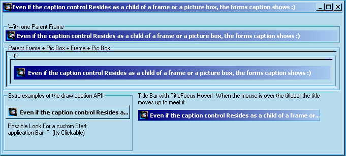



## PureGold TitleBar Control \(Also Great demonstartion of the drawborder API\)

### Description

An excellent emample on how to use the drawcaption API all in a nice OCX included in it is a form with some exmaples of what it can do! Even alpha blending the form is possible, or creating your own task bar buttons ;)

NEW:

1) Ttitle Bar Feature that when the mouse is over the titlebar the bar draws a border around itself and looks as if its moving up to meet the mouse!

2) All Bugs Fixed (when working in design mode the control would cause vb to do some strange stuff)

3) Mouse Enter and MouseLeve events now Available!

Check it out :)
 
### More Info
 

             |
---                |---
**Submitted On**   |2000-08-19 20:07:12
**By**             |[Jameson King](https://github.com/Planet-Source-Code/PSCIndex/blob/master/ByAuthor/jameson-king.md)
**Level**          |Advanced
**User Rating**    |3.9 (27 globes from 7 users)
**Compatibility**  |VB 6\.0
**Category**       |[Windows API Call/ Explanation](https://github.com/Planet-Source-Code/PSCIndex/blob/master/ByCategory/windows-api-call-explanation__1-39.md)
**World**          |[Visual Basic](https://github.com/Planet-Source-Code/PSCIndex/blob/master/ByWorld/visual-basic.md)
**Archive File**   |[CODE\_UPLOAD91348192000\.zip](https://github.com/Planet-Source-Code/jameson-king-puregold-titlebar-control-also-great-demonstartion-of-the-drawborder-api__1-10311/archive/master.zip)

